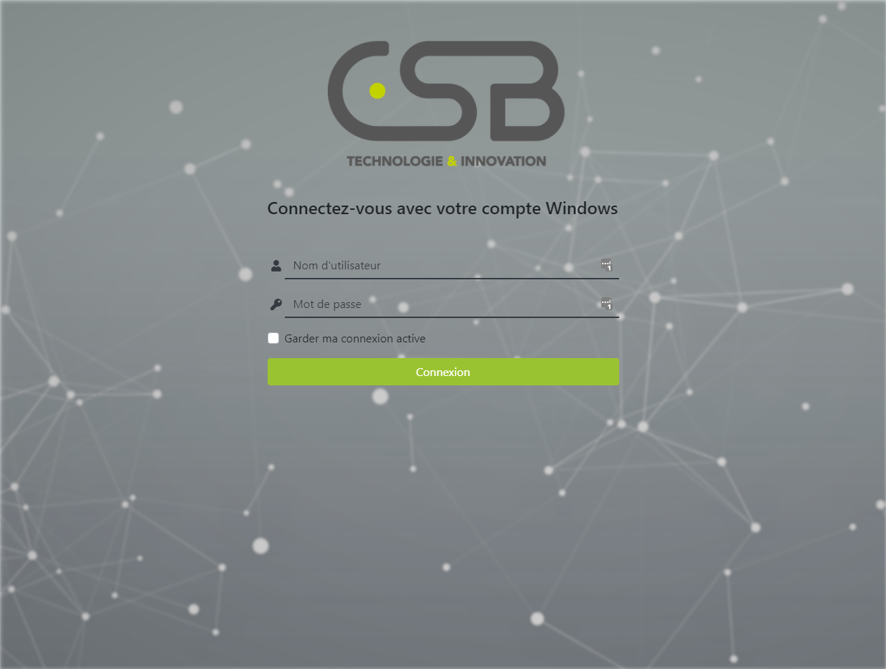
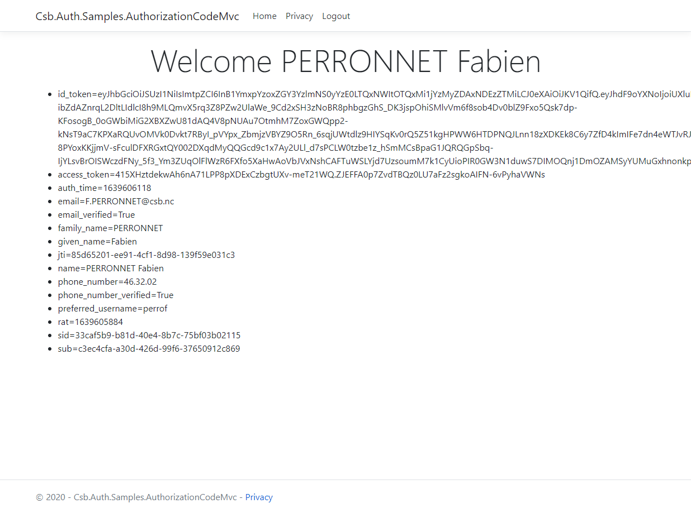

# Identity Provider - Procédure de déploiement

Cette page contient la procédure de déploiement de tous les composants de l'Identity Provider.

## Création du namespace

Commencez par créer le namespace `security` :

```bash
kubectl create ns security
```

Puis créez l'issuer dans le namespace :

```bash
kubectl apply -f issuer.yaml
```

## Création des secrets

> ℹ️ Cette étape est facultative si les secrets existent déjà.

### `grpc-ldap`

Créez le secret qui contiendra le compte LDAP pour intérroger le connecteur LDAPS dans Azure :

```bash
kubectl create secret generic ldap-csb-account --from-literal=username=${Username} --from-literal=password=${Password}
```

> ⚠️ `${Username}` et `${Password}` sont à récupérer depuis l'entrée "LDAP Azure AD" dans Keepass.

Créez le secret qui contiendra la chaîne de certificat utilisée par le connecteur LDAPS dans Azure :

```bash
kubectl create secret generic ldap-csb-cert --from-file=cert-chain.pem=/path/to/the/file
```

> ⚠️ Le certificat est a récupérer dans les fichiers joints de l'entrée "LDAPS connector cert chain" dans Keepass.

### `grpc-accounts`

Créez le secret qui contiendra le fichier JSON avec les utilisateurs :

```bash
kubectl create secret generic grpc-accounts-users --from-file=users.json=/path/to/the/file
```

> ⚠️ Si aucun utilisateur n'est à renseigner, le fichier doit contenir un tableau json vide `[]`.

### `postgres`

Créez le secret qui contiendra les mots de passe de Postgres.

```bash
kubectl create secret generic postgres-passwords --from-literal=postgresql-password=${PostgresPassword} --from-literal=repmgr-password=${PostgresRepMgrPassword}
```

> ⚠️ `${PostgresPassword}` et `${PostgresRepMgrPassword}` sont à récupérer depuis les entrées "Applications > Auth > K8S GCP > Postgres - postgres user" et "Applications > Auth > K8S GCP > Postgres - repmgr user" dans Keepass.

### `hydra`

Créez le secret qui contiendra les chaînes de connexions et les informations sensibles d'Hydra :

```bash
kubectl create secret generic hydra-secrets --from-literal=dsn=${HydraDsn} --from-literal=secretsSystem=${HydraSecretsSytem} --from-literal=secretsCookie=${HydraSecretsCookie}
```

> ⚠️ `${HydraDsn}` est une chaîne de connexion à configurer en suivant les [exemples Hydra](https://github.com/ory/hydra/blob/master/quickstart-postgres.yml). Le compte de base de données est à récupérer dans l'entrée "Applications > Auth > IDP postgres" dans Keepass.<br />
> ⚠️ `${HydraSecretsSytem}` et `${HydraSecretsCookie}` sont à récupérer depuis les entrées "Applications > Auth > Hydra secrets system" et "Applications > Auth > Hydra secrets cookie" dans Keepass.

### `idp`

Créez le secret qui contiendra le certificat pour l'API DataProtection et la chaîne de connexion pour le stockage de la clé de chiffrement :

```bash
kubectl create secret generic idp-dataprotection --from-file=data-protection.pfx=/path/to/the/file --from-literal=data-protection.pass=${DataProtectionPass} --from-literal=data-protection.cstr=${DataProtectionCstr}
```

> ⚠️ `${DataProtectionPass}` ainsi que le fichier du certificat se trouvent dans l'entrée "Application > Auth > Data protection certificate" dans Keepass.<br />
> ⚠️ `${DataProtectionCstr}` est la chaîne de connexion au format `Host=${PostgresHost};Database=idp;Username=${Username};Password=${Password};Port=${PostgresPort}`. `${PostgresHost}` et `${PostgresPort}` dépendent du déploiement de Postgres. `${Username}` et `${Password}` sont à récupérer dans l'entrée "Applications > Auth > IDP postgres" dans Keepass.

Créez le secret qui contiendra le client OAuth 2.0 pour le sample authorization-code-mvc :

```bash
kubectl create secret generic samples-authorization-code-mvc-oauth2-client --from-literal=clientId=${ClientId} --from-literal=clientSecret=${ClientSecret}
```

> ⚠️ `${ClientId}` et `${ClientSecret}` sont à récupérer dans l'entrée "Application > Auth > Sample authorization_code MVC client" dans Keepass.

## Déploiement de Postgres

Si ce n'est pas déjà fait, ajoutez le repo Helm `bitnami` :

```bash
helm repo add bitnami https://charts.bitnami.com/bitnami
helm repo update
```

Puis installez le chart `bitnami/postgresql-ha` en utilisant le fichier de valeur `bitnami-postgresql-ha/values.yaml` :

```bash
helm install -f bitnami-postgresql-ha/values.yaml postgres bitnami/postgresql-ha
```

Ouvrez un proxy de votre poste vers un des pods de Postgres :

```bash
kubectl port-forward --namespace security svc/postgres-postgresql-ha-pgpool 5432:5432
```

Puis connectez-vous à la base `idp` avec un client SQL (i.e. DBeaver), et exécutez les requêtes suivantes pour créer les schémas :

```sql
create schema if not exists hydra authorization idp;
create schema if not exists data_protection authorization idp;
```

## Déploiement d'Hydra

Si ce n'est pas déjà fait, ajoutez le repo Helm `ory` :

```bash
helm repo add ory https://k8s.ory.sh/helm/charts
helm repo update
```

Puis installez le chart `ory/hydra` en utilisant le fichier de valeur `ory-hydra/values.yaml` :

```bash
helm upgrade --install -f ory-hydra/values.yaml hydra ory/hydra
```

## Déploiement de l'IDP

Installez le chart `idp`:

```bash
helm upgrade --install idp idp/
```

## Déploiement du sample authorization-code-mvc

Installez le chart `sample-authorization-code-mvc` :

```bash
helm upgrade --install sample-authorization-code-mvc samples/authotization-code-mvc
```

## Déploiement des gRPC

### `grpc-ldap`

> ℹ️ Le chart du `grpc-ldap` se trouve dans le repo Git suivant : https://github.com/csbiti/auth-stores/tree/master/charts/grpc-ldap

Installez le chart :

```bash
helm upgrade --install grpc-ldap /path/to/the/repo/chart
```

### `grpc-accounts`

> ℹ️ Le chart du `grpc-accounts` se trouve dans le repo Git suivant : https://github.com/csbiti/auth-stores/tree/master/charts/grpc-accounts

Installez le chart :

```bash
helm upgrade --install grpc-accounts /path/to/the/repo/chart
```

## Déploiement de l'API `directory`

> ℹ️ Le chart de l'API `directory` se trouve dans le repo Git suivant : https://github.com/csbiti/auth-directory/tree/master/charts/directory

Intallez le chart :

```bash
helm upgrade --install directory /path/to/the/repo/chart
```

## Créez la configuration du sample

Ouvrez un proxy avec l'API admin d'Hydra :

```bash
kubectl port-forward svc/hydra-admin 4445:4445
```

Faites un HTTP post sur `http://localhost:4445/clients` avec le JSON suivant pour créer le client OAuth 2.0 du sample :

```json
{
    "client_id": "test_authorization_code",
    "client_name": "Test with authorization_code flow",
    "redirect_uris": [
        "https://connect.csb.nc/samples/authorization-code-mvc/signin-oidc"
    ],
    "grant_types": [
        "client_credentials",
        "authorization_code"
    ],
    "response_types": [
        "code"
    ],
    "scope": "openid profile email phone_number offline_access",
    "audience": [
        "test"
    ],
    "owner": "",
    "policy_uri": "",
    "allowed_cors_origins": [],
    "tos_uri": "",
    "client_uri": "",
    "logo_uri": "",
    "contacts": [],
    "client_secret_expires_at": 0,
    "subject_type": "public",
    "jwks": {},
    "token_endpoint_auth_method": "client_secret_post",
    "userinfo_signed_response_alg": "none",
    "created_at": "2021-09-15T22:59:31Z",
    "updated_at": "2021-09-15T22:59:30.938716Z",
    "frontchannel_logout_uri": "https://connect.csb.nc/samples/authorization-code-mvc/frontchannel-logout",
    "frontchannel_logout_session_required": true,
    "post_logout_redirect_uris": [
        "https://connect.csb.nc/samples/authorization-code-mvc/signout-callback-oidc"
    ],
    "backchannel_logout_uri": "https://connect.csb.nc/samples/authorization-code-mvc/backchannel-logout",
    "backchannel_logout_session_required": true,
    "metadata": {
        "store": "ldap"
    }
}
```

```bash
curl -XPOST -H 'Content-Type: application/json' -d '{"client_id":"test_authorization_code","client_name":"Test with authorization_code flow","redirect_uris":["https://connect.csb.nc/samples/authorization-code-mvc/signin-oidc"],"grant_types":["client_credentials","authorization_code"],"response_types":["code"],"scope":"openid profile email phone_number offline_access","audience":["test"],"owner":"","policy_uri":"","allowed_cors_origins":[],"tos_uri":"","client_uri":"","logo_uri":"","contacts":[],"client_secret_expires_at":0,"subject_type":"public","jwks":{},"token_endpoint_auth_method":"client_secret_post","userinfo_signed_response_alg":"none","created_at":"2021-09-15T22:59:31Z","updated_at":"2021-09-15T22:59:30.938716Z","frontchannel_logout_uri":"https://connect.csb.nc/samples/authorization-code-mvc/frontchannel-logout","frontchannel_logout_session_required":true,"post_logout_redirect_uris":["https://connect.csb.nc/samples/authorization-code-mvc/signout-callback-oidc"],"backchannel_logout_uri":"https://connect.csb.nc/samples/authorization-code-mvc/backchannel-logout","backchannel_logout_session_required":true,"metadata":{"store":"ldap"}}' http://localhost:4445/clients
```

## Tester la connexion

Accédez à : https://connect.csb.nc/samples/authorization-code-mvc

Vous êtes redirigé sur la page de connexion : 



Saisissez vos identifiants Windows puis validez, vous êtes redirigé sur la page du sample :

