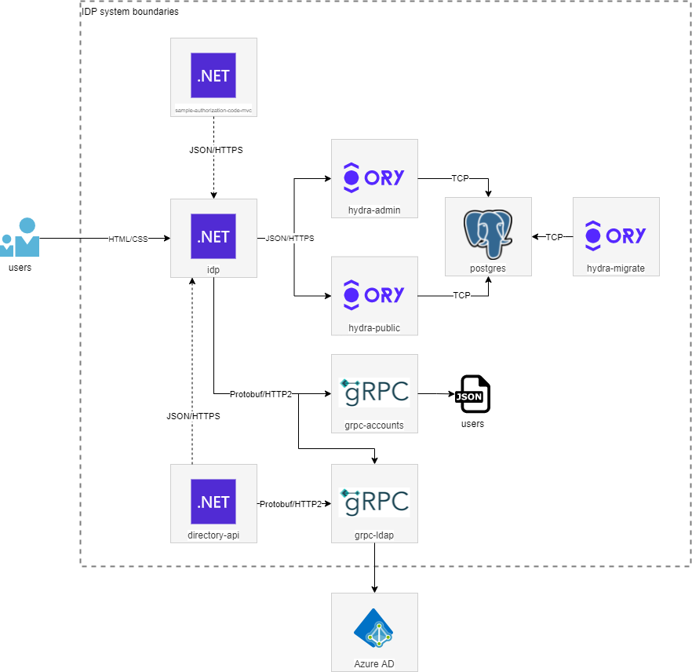

# Identity Provider - Architecture

Cette page décrit l'architecture de l'Identity Provider.

1. [Accueil](README.md)
2. [Spécifications fonctionnelles](functional_spec.md)
3. [Spécifications techniques](technical_spec.md)
4. [Architecture](architecture.md)
5. [Database](database.md)

## Architecture

L'architecture est de type microservices. Les différentes modules sont les suivants :

| Module                          | Description                                                                                                                                      |
| ------------------------------- | ------------------------------------------------------------------------------------------------------------------------------------------------ |
| `idp`                           | L'interface utilisateur présentant les écrans de connexion et déconnexion aux utilisateurs'.                                                     |
| `grpc-ldap`                     | Le gRPC responsable de valider les credentials utilisateurs avec Azure AD avec le protocol LDAP.                                                 |
| `grpc-accounts`                 | Le gRPC responsable de valider les credentials utilisateurs avec un fichier JSON.                                                                |
| `hydra-admin`                   | L'API admin d'Hydra.                                                                                                                             |
| `hydra-public`                  | L'API public d'Hydra.                                                                                                                            |
| `hydra-migrate`                 | Le job de migration pour le schéma `hydra` dans la base de données.                                                                              |
| `postgres`                      | La base de données stockant les données de l'IDP.                                                                                                |
| `sample-authorization-code-mvc` | Le sample permettant de valider le bon fonctionnement de l'IDP avec le grant type `authorization_code`.                                          |
| `directory-api      `           | L'API permattant de rechercher dans l'annuaire AD à partir du gRPC LDAP.                                                                         |
| `Azure AD`                      | Le contrôleur de domaine dans Azure.                                                                                                             |

Le schéma suivant permet d'illuster les différentes connexions qui existent entre les modules :

Les modules sont développés avec les langages et frameworks suivants :

| Module                          | Langage                 | Version | Framework         | Version  |
| ------------------------------- | ----------------------- | ------- | ----------------- | -------- |
| `idp`                           | C#                      | 9       | .NET/ASP.NET Core | 5        |
| `grpc-ldap`                     | Go                      | 1.15.3  | N/A               | N/A      |
| `grpc-accounts`                 | Go                      | 1.15.3  | N/A               | N/A      |
| `sample-authorization-code-mvc` | C#                      | 9       | .NET/ASP.NET Core | N/A      |
| `directory-api`                 | C#                      | 9       | .NET/ASP.NET Core | 5        |

Les briques logicielles utilisées le sont dans les versions suivantes :

| Brique            | Version |
| ----------------- | ------- |
| `hydra`           | 1.19.5  |
| `postgres`        | 13.1    |